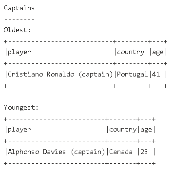

# Age Range Summary (Oldest vs Youngest)

## What this script does
This script extracts numeric age from date_of_birth_age, then reports the oldest and youngest player in each category:

1. Outfield players
2. Goalkeepers
3. Captains

## Output
Printed Spark tables (one oldest row and one youngest row per category).

## Findings
This section quickly highlights age extremes and gives an easy quality check for age parsing across the dataset.

## Image placeholders




## Script
```python
from pyspark.sql import functions as F

# 1) Load Lakehouse table.
#    Extract numeric age (years) from text like "May 17, 2000 (aged 26)".
#    Create a simple captain flag by checking if player text contains "captain".
#    Keep only rows where age was successfully extracted.
df = (
    spark.table("worldcup_squads_all")
    .withColumn("age", F.regexp_extract(F.col("date_of_birth_age"), r"aged\s+(\d+)", 1).cast("int"))
    .withColumn("is_captain", F.lower(F.col("player")).contains("captain"))
    .filter(F.col("age").isNotNull())
)

# 2) Normalize position values (remove spaces, force uppercase),
#    so GK filtering is consistent even if source text varies.
df = df.withColumn("pos_norm", F.upper(F.trim(F.col("pos"))))

# 3) Split data into analysis groups.
outfield = df.filter(F.col("pos_norm") != "GK")
goalkeepers = df.filter(F.col("pos_norm") == "GK")
captains = df.filter(F.col("is_captain"))

# 4) Helper function:
#    For any given subset, return one oldest and one youngest player.
#    If ages tie, sort by player name for stable output.
def oldest_and_youngest(label, frame):
    oldest = frame.orderBy(F.desc("age"), F.asc("player")).select("player", "country", "age").limit(1)
    youngest = frame.orderBy(F.asc("age"), F.asc("player")).select("player", "country", "age").limit(1)

    # 5) Print a readable block for this category.
    print(f"\n{label}")
    print("-" * len(label))
    print("Oldest:")
    oldest.show(truncate=False)
    print("Youngest:")
    youngest.show(truncate=False)

# 6) Run the same logic for each category.
oldest_and_youngest("Outfield players", outfield)
oldest_and_youngest("Goalkeepers", goalkeepers)
oldest_and_youngest("Captains", captains)
```
