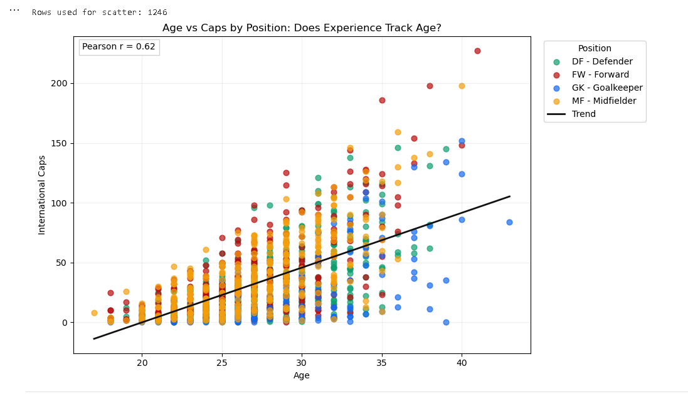

# Age vs Caps by Position

## What this analysis shows
This analysis tests whether older players tend to have more international caps.

Cap represents an appearance for a player's national team, making it a useful measure of international experience.

- X-axis: age
- Y-axis: international caps
- Color: player position (`GK`, `DF`, `MF`, `FW`)
- Additional signal: linear trend line and Pearson correlation

## Findings summary
- The trend line slopes upward, which indicates a positive relationship between age and caps.
- The correlation value (`Pearson r`) quantifies the relationship strength.
- The point spread shows that age is important, but not the only factor behind caps.

Pearson correlation (r) helps measure whether older players tend to have more international caps. The closer the value is to +1, the stronger the relationship between age and international experience.

## Chart image



## Script
```python
from pyspark.sql import functions as F
import matplotlib.pyplot as plt
import numpy as np

# 1) Load source table
source = spark.table("worldcup_squads_all")

# 2) Resolve which caps column exists
caps_candidates = ["caps", "apps", "appearances"]
existing_caps_cols = [c for c in caps_candidates if c in source.columns]

if not existing_caps_cols:
    raise ValueError(
        "No caps column found. Expected one of: caps, apps, appearances. "
        f"Available columns: {source.columns}"
    )

caps_col = existing_caps_cols[0]

# Position label mapping
pos_meaning = {
    "GK": "Goalkeeper",
    "DF": "Defender",
    "MF": "Midfielder",
    "FW": "Forward",
}

# Fixed color mapping by position
position_colors = {
    "GK": "#3B82F6",  # blue
    "DF": "#10B981",  # green
    "MF": "#F59E0B",  # amber
    "FW": "#EF4444",  # red
}

# Optional fallback used if another code appears
def to_pos_label(code):
    code = str(code).strip().upper()
    return f"{code} - {pos_meaning.get(code, 'Other/Unknown')}"

# 3) Build analysis dataset with clean numeric fields
analysis_df = (
    source
    .withColumn("age", F.regexp_extract(F.col("date_of_birth_age"), r"aged\\s+(\\d+)", 1).cast("int"))
    .withColumn("caps_num", F.regexp_extract(F.col(caps_col).cast("string"), r"(\\d+)", 1).cast("int"))
    .withColumn("pos_norm", F.upper(F.trim(F.col("pos"))))
    .filter(F.col("age").isNotNull() & F.col("caps_num").isNotNull() & F.col("pos_norm").isNotNull())
    .select("pos_norm", "country", "player", "age", "caps_num")
)

print("Rows used for scatter:", analysis_df.count())

# 4) Move to pandas for plotting
pdf = analysis_df.toPandas()

# 5) Scatter plot colored by position
fig, ax = plt.subplots(figsize=(10, 6))

positions = sorted(pdf["pos_norm"].dropna().unique().tolist())

for p in positions:
    part = pdf[pdf["pos_norm"] == p]
    ax.scatter(
        part["age"],
        part["caps_num"],
        s=28,
        alpha=0.7,
        color=position_colors.get(p, "#3B82F6"),
        label=to_pos_label(p),
    )

# 6) Add trend line + Pearson correlation
x = pdf["age"].to_numpy(dtype=float)
y = pdf["caps_num"].to_numpy(dtype=float)

if len(pdf) >= 2:
    slope, intercept = np.polyfit(x, y, 1)
    x_line = np.linspace(x.min(), x.max(), 100)
    y_line = slope * x_line + intercept
    ax.plot(x_line, y_line, color="#111111", linewidth=2, label="Trend")

    corr = float(np.corrcoef(x, y)[0, 1])
    ax.text(
        0.02,
        0.98,
        f"Pearson r = {corr:.2f}",
        transform=ax.transAxes,
        va="top",
        ha="left",
        bbox={"facecolor": "white", "alpha": 0.8, "edgecolor": "#cccccc"},
    )

ax.set_title("Age vs Caps by Position: Does Experience Track Age?")
ax.set_xlabel("Age")
ax.set_ylabel("International Caps")
ax.grid(alpha=0.2)
ax.legend(title="Position", bbox_to_anchor=(1.02, 1), loc="upper left")

plt.tight_layout()
plt.show()
```
