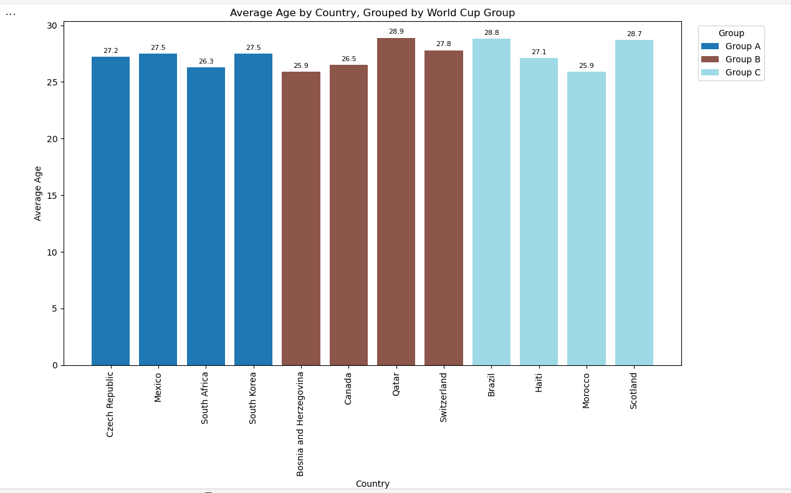

# Average Age by Country Grouped by World Cup Group

## What this script does
Calculates average age per country, keeps a limited subset, and colors bars by group.

## Output
Grouped bar chart with value labels and legend.

## Findings
The grouped view makes cross-group comparison easier. In this sample, some Group B and Group C teams appear older than Group A teams, while the overall spread remains moderate.

## Image placeholder


## Script
```python
from pyspark.sql import functions as F
import matplotlib.pyplot as plt
from matplotlib.patches import Patch

avg_age_by_country = (
    spark.table("worldcup_squads_all")
    .withColumn("age", F.regexp_extract(F.col("date_of_birth_age"), r"aged\s+(\d+)", 1).cast("int"))
    .filter(F.col("age").isNotNull())
    .groupBy("group", "country")
    .agg(F.round(F.avg("age"), 1).alias("avg_age"))
    .orderBy(F.asc("group"), F.asc("country"))
    .limit(12)
)

df = avg_age_by_country.toPandas()

fig, ax = plt.subplots(figsize=(12, 8))

group_order = list(df["group"].astype("category").cat.categories)
palette = plt.get_cmap("tab20", len(group_order))
color_map = {group: palette(i) for i, group in enumerate(group_order)}

bars = ax.bar(df["country"], df["avg_age"], color=df["group"].map(color_map))

ax.set_title("Average Age by Country, Grouped by World Cup Group")
ax.set_xlabel("Country")
ax.set_ylabel("Average Age")
ax.tick_params(axis="x", rotation=90)

ax.bar_label(bars, fmt="%.1f", padding=3, fontsize=8)

legend_items = [Patch(facecolor=color_map[group], label=group) for group in group_order]
ax.legend(handles=legend_items, title="Group", bbox_to_anchor=(1.02, 1), loc="upper left")

plt.tight_layout()
```
