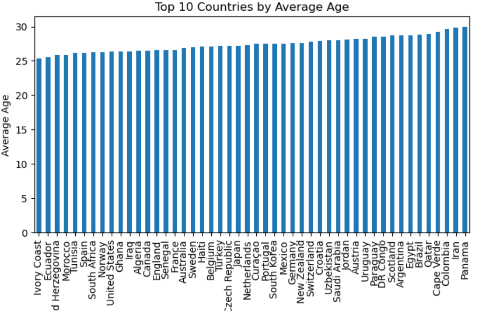

# Average Age by Country

## What this script does
Computes average player age per country and sorts countries by average age (ascending).

## Output
Bar chart of average age by country.

## Findings
Average squad ages are mostly concentrated in the upper 20s, with a smaller set of countries closer to 30. The chart is useful for spotting younger vs older squads at a glance.

## Image placeholder


## Script
```python
from pyspark.sql import functions as F

avg_age_by_country = (
    spark.table("worldcup_squads_all")
    .withColumn("age", F.regexp_extract(F.col("date_of_birth_age"), r"aged\s+(\d+)", 1).cast("int"))
    .filter(F.col("age").isNotNull())
    .groupBy("country")
    .agg(F.round(F.avg("age"), 1).alias("avg_age"))
    .orderBy(F.asc("avg_age"))
    .limit(50)
)

df = avg_age_by_country.toPandas()

ax = df.plot(kind="bar", x="country", y="avg_age", figsize=(8,4), legend=False, title="Top 10 Countries by Average Age")
ax.set_xlabel("Country")
ax.set_ylabel("Average Age")
```
