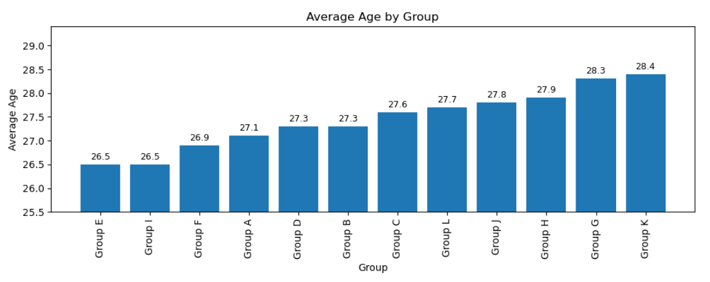

# Average Age by Group

## What this script does
Calculates average age for each World Cup group and plots the result.

## Output
Bar chart with exact value labels above each bar.

## Findings
Group-level age differences exist, but they are relatively small. This view is useful for comparing overall age profiles without country-level detail.

## Image


## Script
```python
from pyspark.sql import functions as F
import matplotlib.pyplot as plt

avg_age_by_group = (
    spark.table("worldcup_squads_all")
    .withColumn("age", F.regexp_extract(F.col("date_of_birth_age"), r"aged\s+(\d+)", 1).cast("int"))
    .filter(F.col("age").isNotNull())
    .groupBy("group")
    .agg(F.round(F.avg("age"), 1).alias("avg_age"))
    .orderBy("avg_age")
)

df = avg_age_by_group.toPandas()

fig, ax = plt.subplots(figsize=(10, 4))
bars = ax.bar(df["group"], df["avg_age"])

ax.set_title("Average Age by Group")
ax.set_xlabel("Group")
ax.set_ylabel("Average Age")

# Optional: zoom y-axis a bit so tiny differences are easier to see
ymin = max(0, df["avg_age"].min() - 1)
ymax = df["avg_age"].max() + 1
ax.set_ylim(ymin, ymax)

# Add exact values on top of bars
ax.bar_label(bars, fmt="%.1f", padding=3, fontsize=9)

plt.xticks(rotation=90)
plt.tight_layout()
plt.show()
```
