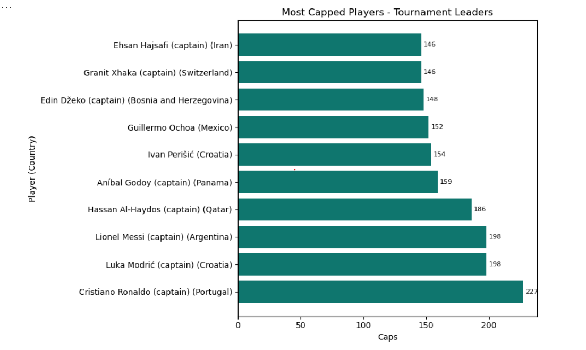

# Most Capped Players (Tournament Leaders)

## What this script does
Extracts numeric caps and ranks players by total caps across the full tournament dataset.

## Output
Horizontal bar chart of the top 10 most capped players.

## Findings
This chart highlights the most experienced internationals and makes label reading easier with a horizontal layout.

## Image placeholder


## Script
```python
from pyspark.sql import functions as F
from pyspark.sql.window import Window
import matplotlib.pyplot as plt

# 1) Load table and pick the first caps-like column that actually exists.
source = spark.table("worldcup_squads_all")
caps_candidates = ["caps", "apps", "appearances"]
existing_caps_cols = [c for c in caps_candidates if c in source.columns]

if not existing_caps_cols:
    raise ValueError(
        "No caps column found. Expected one of: caps, apps, appearances. "
        f"Available columns: {source.columns}"
    )

caps_col = existing_caps_cols[0]

# 2) Parse caps as integer from common formats, e.g. 123 or "123 (45)".
caps_base = (
    source
    .withColumn(
        "caps_num",
        F.regexp_extract(
            F.coalesce(F.col(caps_col).cast("string"), F.lit("")),
            r"(\d+)",
            1,
        ).cast("int"),
    )
    .filter(F.col("caps_num").isNotNull())
    .select("group", "country", "player", "caps_num")
)

# 3) View 1: Most capped players in the tournament
top_overall = (
    caps_base
    .orderBy(F.desc("caps_num"), F.asc("player"))
    .limit(10)
)

pdf_overall = top_overall.toPandas()
pdf_overall["label"] = pdf_overall["player"] + " (" + pdf_overall["country"] + ")"

# Horizontal version (readable labels)
# Sort so the largest value appears at the top after invert_yaxis
pdf_overall = pdf_overall.sort_values("caps_num", ascending=True)

fig1, ax1 = plt.subplots(figsize=(9, 6))
bars1 = ax1.barh(pdf_overall["label"], pdf_overall["caps_num"], color="#0F766E")

ax1.set_title("Most Capped Players - Tournament Leaders")
ax1.set_xlabel("Caps")
ax1.set_ylabel("Player (Country)")

# Put value labels at the end of each horizontal bar
ax1.bar_label(bars1, fmt="%d", padding=3, fontsize=8)

# Highest caps at the top
ax1.invert_yaxis()

plt.tight_layout()
plt.show()
```
