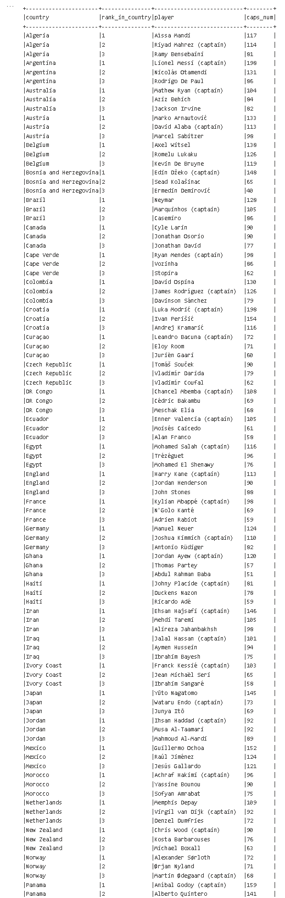
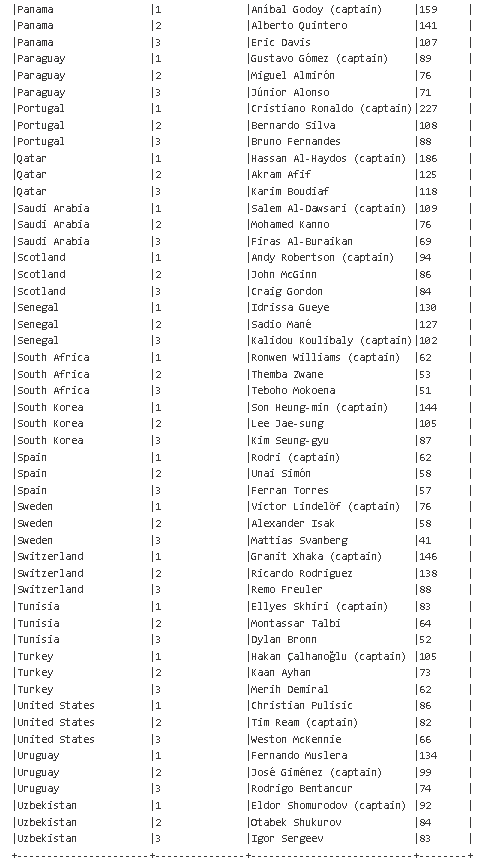

# Top 3 Most Capped Players in Each Team

## What this script does
Ranks players by caps within each country and keeps the top three.

## Output
Spark table output with:

- country
- rank_in_country
- player
- caps_num

Optional second cell creates a compact pivot table (Top 1, Top 2, Top 3) per country.

## Findings
This section reveals how experience is distributed inside each squad and helps identify teams with a strong veteran core.

## Image


## Exported Data
[Top 3 Capped by Team Table](Data/top3_most_capped_players_by_team.csv)

[Top 3 Capped by Team Pivot](Data/top3_most_capped_players_by_team_pivot.csv)

## Script
```python
from pyspark.sql import functions as F
from pyspark.sql.window import Window
import matplotlib.pyplot as plt

# 1) Load table and pick the first caps-like column that actually exists.
source = spark.table("worldcup_squads_all")
caps_candidates = ["caps", "apps", "appearances"]
existing_caps_cols = [c for c in caps_candidates if c in source.columns]

if not existing_caps_cols:
    raise ValueError(
        "No caps column found. Expected one of: caps, apps, appearances. "
        f"Available columns: {source.columns}"
    )

caps_col = existing_caps_cols[0]

# 2) Parse caps as integer from common formats, e.g. 123 or "123 (45)".
caps_base = (
    source
    .withColumn(
        "caps_num",
        F.regexp_extract(
            F.coalesce(F.col(caps_col).cast("string"), F.lit("")),
            r"(\d+)",
            1,
        ).cast("int"),
    )
    .filter(F.col("caps_num").isNotNull())
    .select("group", "country", "player", "caps_num")
)
# 3) View: Most capped players within each team (top 3 per country) as a table

w = Window.partitionBy("country").orderBy(F.desc("caps_num"), F.asc("player"))

top_within_team = (
    caps_base
    .withColumn("rank_in_country", F.row_number().over(w))
    .filter(F.col("rank_in_country") <= 3)
    .orderBy(F.asc("country"), F.asc("rank_in_country"))
)

# Table output in Spark (best for long lists)
top_within_team.select("country", "rank_in_country", "player", "caps_num").show(300, truncate=False)
```

```python
# Optional: compact pivot table (one row per country, columns for top 1/2/3)
pdf_team = top_within_team.select("country", "rank_in_country", "player", "caps_num").toPandas()
pdf_team["player_caps"] = pdf_team["player"] + " (" + pdf_team["caps_num"].astype(str) + ")"

pivot = (
    pdf_team
    .pivot(index="country", columns="rank_in_country", values="player_caps")
    .rename(columns={1: "Top 1", 2: "Top 2", 3: "Top 3"})
    .reset_index()
    .sort_values("country")
)

print("\nTop 3 Most Capped Players in Each Team")
print(pivot.to_string(index=False))
```

## Image full table 


