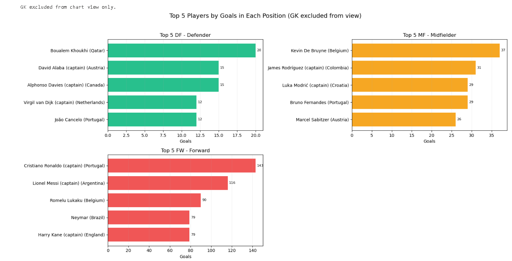

# Top 5 Goalscorers by Position

## What this analysis shows
This analysis ranks players by goals within each position and creates a clean visual view.

- Summary table by position
- Top 5 players by goals per position
- Multi-panel chart view by position
- Goalkeepers (`GK`) excluded from the chart view for readability

## Findings summary
- For this dataset, attacking and midfield roles contribute most of the goals.
- The script prints explicit messages when a position has zero total goals.
- The chart is easier to read with separate panels per position.

## Table and chart images (to add)
Add your exported images in a folder called `images` and keep these paths.




## Script
```python
from pyspark.sql import functions as F
from pyspark.sql.window import Window
import matplotlib.pyplot as plt
import math

# 1) Load source table
source = spark.table("worldcup_squads_all")

# 2) Resolve goals column safely
goals_candidates = ["goals", "goal"]
existing_goals_cols = [c for c in goals_candidates if c in source.columns]

if not existing_goals_cols:
    raise ValueError(
        "No goals column found. Expected one of: goals, goal. "
        f"Available columns: {source.columns}"
    )

goals_col = existing_goals_cols[0]

# 3) Clean and normalize fields
base = (
    source
    .withColumn("pos_norm", F.upper(F.trim(F.col("pos"))))
    .withColumn("player_name", F.trim(F.col("player")))
    .withColumn("country_name", F.trim(F.col("country")))
    .withColumn("goals_num", F.regexp_extract(F.col(goals_col).cast("string"), r"(\\d+)", 1).cast("int"))
    .filter(F.col("pos_norm").isNotNull() & (F.col("pos_norm") != ""))
    .filter(F.col("player_name").isNotNull() & (F.col("player_name") != ""))
)

# 4) Position summary (includes zeros and keeps GK for audit)
pos_master = spark.createDataFrame([("GK",), ("DF",), ("MF",), ("FW",)], ["pos_norm"])

summary = (
    pos_master
    .join(
        base.groupBy("pos_norm").agg(
            F.count("*").alias("players_count"),
            F.sum(F.coalesce(F.col("goals_num"), F.lit(0))).alias("total_goals"),
            F.sum(F.when(F.col("goals_num") > 0, 1).otherwise(0)).alias("players_with_goals")
        ),
        on="pos_norm",
        how="left"
    )
    .fillna(0, subset=["players_count", "total_goals", "players_with_goals"])
    .orderBy("pos_norm")
)

print("Goals summary by position:")
summary.show(truncate=False)

# Print explicit no-data / zero-goal message
no_data_positions = [r["pos_norm"] for r in summary.filter(F.col("total_goals") == 0).collect()]
if no_data_positions:
    print("No data (0 total goals) for positions:", ", ".join(no_data_positions))

# 5) Rank top 5 players by goals within each position
ranked_base = base.filter(F.col("goals_num").isNotNull())

w = Window.partitionBy("pos_norm").orderBy(F.desc("goals_num"), F.asc("player_name"))

top5_each_position = (
    ranked_base
    .withColumn("rank_in_position", F.row_number().over(w))
    .filter((F.col("rank_in_position") <= 5) & (F.col("pos_norm") != "GK"))
    .select("pos_norm", "rank_in_position", "player_name", "country_name", "goals_num")
    .orderBy(F.asc("pos_norm"), F.asc("rank_in_position"))
)

print("Top 5 players by goals in each position:")
top5_each_position.show(200, truncate=False)

# 6) Chart view only: exclude GK
pdf = top5_each_position.toPandas()
plot_pdf = pdf[pdf["pos_norm"] != "GK"].copy()

print("GK excluded from chart view only.")

if plot_pdf.empty:
    print("No non-GK data available to plot.")
else:
    pos_names = {
        "GK": "Goalkeeper",
        "DF": "Defender",
        "MF": "Midfielder",
        "FW": "Forward",
    }

    colors = {
        "DF": "#10B981",  # green
        "MF": "#F59E0B",  # amber
        "FW": "#EF4444",  # red
    }

    # Order common positions first
    ordered_positions = [p for p in ["DF", "MF", "FW"] if p in plot_pdf["pos_norm"].unique()]
    extra_positions = sorted([p for p in plot_pdf["pos_norm"].unique() if p not in ordered_positions])
    positions = ordered_positions + extra_positions

    n = len(positions)
    ncols = 2
    nrows = math.ceil(n / ncols)

    fig, axes = plt.subplots(nrows=nrows, ncols=ncols, figsize=(16, 4 * nrows))
    axes = axes.flatten() if n > 1 else [axes]

    for i, pos in enumerate(positions):
        ax = axes[i]
        part = plot_pdf[plot_pdf["pos_norm"] == pos].copy().sort_values("goals_num", ascending=True)
        part["label"] = part["player_name"] + " (" + part["country_name"] + ")"

        bars = ax.barh(
            part["label"],
            part["goals_num"],
            color=colors.get(pos, "#6B7280"),
            alpha=0.9
        )

        ax.set_title(f"Top 5 {pos} - {pos_names.get(pos, 'Other')}")
        ax.set_xlabel("Goals")
        ax.grid(axis="x", alpha=0.2)
        ax.bar_label(bars, fmt="%d", padding=3, fontsize=8)

    # Hide empty subplot slots
    for j in range(i + 1, len(axes)):
        fig.delaxes(axes[j])

    fig.suptitle("Top 5 Players by Goals in Each Position (GK excluded from view)", fontsize=14, y=1.02)
    plt.tight_layout()
    plt.show()
```