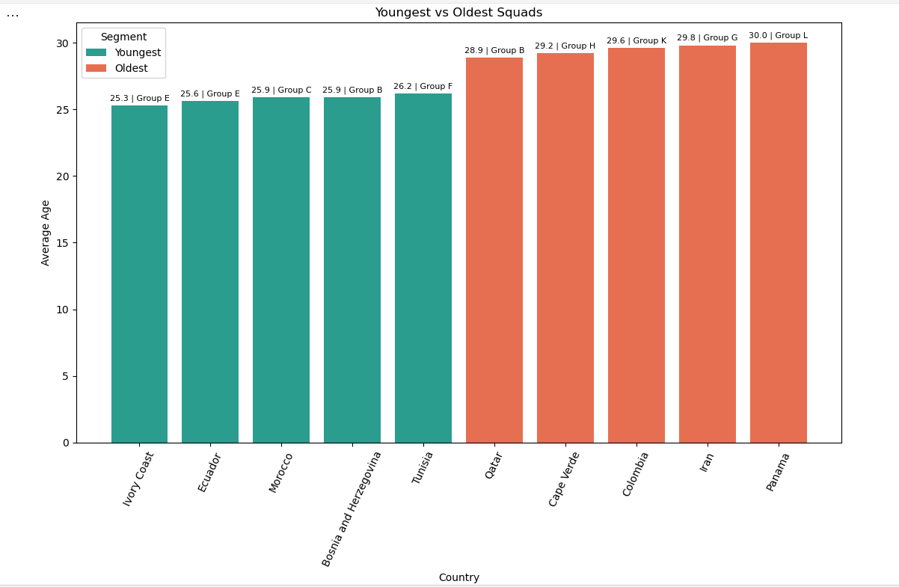

# Youngest vs Oldest Squads (Country Averages)

## What this script does
Builds two segments from country-level average age:

- 5 youngest squads
- 5 oldest squads

## Output
Single comparison chart with segment colors and value labels (age and group).

## Findings
The split view highlights the gap between extremes more clearly than one long ranking. In this run, the spread between youngest and oldest averages is roughly three years.

## Image 


## Script
```python
from pyspark.sql import functions as F
import matplotlib.pyplot as plt
from matplotlib.patches import Patch

base = (
    spark.table("worldcup_squads_all")
    .withColumn("age", F.regexp_extract(F.col("date_of_birth_age"), r"aged\s+(\d+)", 1).cast("int"))
    .filter(F.col("age").isNotNull())
    .groupBy("group", "country")
    .agg(F.round(F.avg("age"), 1).alias("avg_age"))
)

oldest = (
    base.orderBy(F.desc("avg_age"))
    .limit(5)
    .withColumn("segment", F.lit("Oldest"))
)

youngest = (
    base.orderBy(F.asc("avg_age"))
    .limit(5)
    .withColumn("segment", F.lit("Youngest"))
)

df = oldest.unionByName(youngest).toPandas()

# Optional: sort for cleaner visual order (youngest first, then oldest)
df["segment_order"] = df["segment"].map({"Youngest": 0, "Oldest": 1})
df = df.sort_values(["segment_order", "avg_age"], ascending=[True, True]).reset_index(drop=True)

fig, ax = plt.subplots(figsize=(11, 8))

segment_colors = {"Youngest": "#2a9d8f", "Oldest": "#e76f51"}
bar_colors = df["segment"].map(segment_colors)

bars = ax.bar(df["country"], df["avg_age"], color=bar_colors)

ax.set_title("Youngest vs Oldest Squads")
ax.set_xlabel("Country")
ax.set_ylabel("Average Age")
ax.tick_params(axis="x", rotation=65)

# Label above each bar: age and group
labels = [f"{age:.1f} | {grp}" for age, grp in zip(df["avg_age"], df["group"])]
ax.bar_label(bars, labels=labels, padding=3, fontsize=8, rotation=360)

legend_items = [
    Patch(facecolor=segment_colors["Youngest"], label="Youngest"),
    Patch(facecolor=segment_colors["Oldest"], label="Oldest"),
]
ax.legend(handles=legend_items, title="Segment", loc="upper left")

plt.tight_layout()
```
